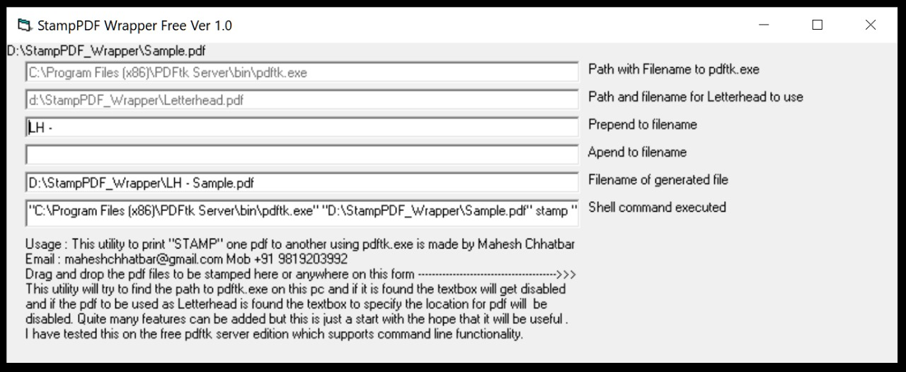

# StampPDF

StampPDF is a simple utility I built to overlay PDFs (like invoices) onto a PDF letterhead using pdftk.exe. Originally, my invoices were printed on physical letterhead. Eventually, I needed digital versions that looked like they were on letterhead. That’s where this tool comes in.

## What it does

It uses pdftk.exe to stamp one PDF (your invoice) onto another (your letterhead), generating a new combined PDF.
Why this utility?

- No command line typing
- Drag-and-drop support
- Easy filename handling

## Requirements

- 

## How it works

There are 5 main input fields

- **pdftk.exe Path** - If pdftk.exe is found in the default install path or in system PATH, the textbox will auto-disable. Otherwise, paste the full path manually.
- **Letterhead PDF** - The background letterhead PDF. Paste the full path and filename. If valid, textbox auto-disables
- **Filename Prepend** - (optional) Defaults to "LH - " to avoid overwriting original files. You can customize it.
- **Filename Append** - (optional) Adds text to the end of the output filename if needed
- **Shell Command** - The actual command being run (for debugging/copy-pasting to a terminal).

## Usage

Just drag and drop the invoice PDF onto the form. A stamped PDF will be created in the same folder, using your defined prepend/append rules. The output filename will be displayed in the last textbox.

## Notes

- Built in VB6, tested with pdftk.exe v2.02.
- Source code includes references to any external snippets used.

## Feedback & Contributions

This is a basic tool — just a starting point. Suggestions welcome!
